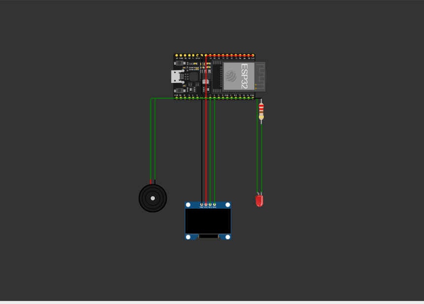

# UNIBRAS - Modelo de Documento para Projetos, Pesquisas e Disciplinas Específicas

<p align="center">
  <a href="https://sejaunibras.com.br"></a>
</p>

---

## 📌 Título do Projeto

## 🏭🥛 Lactec

---

## 👥 Equipe de Autores e Participantes

### 👥 Alunos

* [Luiz Henrique M. Barbosa]
* [Arthur Brito]
* [Haynan Jacob]
* [Fellipe Augusto]

### 👔 Docentes e Orientação

* **Orientador(a):** [FRANCISMAR ALVES MARTINS JUNIOR](https://www.linkedin.com/in/francismar-alves-martins-junior-8a320b90/)
* **Coordenador(a):** [Guilherme Nogueira](#)

---

### 📝 Resumo

> Este trabalho foi feito com o intuito de solucionar o problema de uma empresa láctea, relacionado à temperatura do leite, desde o momento da retirada do produto até a chegada nos comércios.

### 🕹️ Introdução

* Uma empresa da área de laticínios veio até nós com o intuito de solucionar seu problema.
* O problema em questão é a falta de monitoramento da temperatura do leite.
* O objetivo é construir um sensor térmico para monitorar essa temperatura.
  
### 🏁 Conclusões e Trabalhos Futuros

* O resultado final foi a conclusão do projeto, no qual são emitidos alertas sonoros e visuais quando a temperatura chega aos extremos.

### 📄 Identificação

* Disciplina: Arquitetura e Organização de Computadores
* Professor(a): [FRANCISMAR ALVES MARTINS JUNIOR](#)


### 🛠️ Estrutura do Repositório

```python
templatesUNIBRAS/
├─ assets/
│  └─ (imagens, logotipos e recursos visuais para o README e templates)
├─ document/
│  └─ (modelos de documentos em .docx, .pdf ou .md para diferentes usos)
├─ src/
│  └─ (código fonte de exemplos, scripts de automação ou templates LaTeX, se existirem)
├─ .gitattributes
├─ .gitignore
├─ LICENSE
├─ README.md
```


### link do wokwi

(https://wokwi.com/projects/448507547055723521)

### 📷 Evidências Visuais



---

## ⚡️ Critérios de Avaliação (Ex. Disciplinas Específicas)

* Qualidade e clareza do código-fonte.
* Adequação às normas e padrões de projeto.
* Resultado final (usabilidade e eficiência técnica).

---

## 📋 Licença e Atribuições


[Modelo GIT UNIBRAS](https://github.com/yggdrasilGit/templatesUNIBRAS) por [UNIBRAS](https://sejaunibras.com.br) está licenciado sob [CC BY 4.0 International](http://creativecommons.org/licenses/by/4.0/?ref=chooser-v1).
